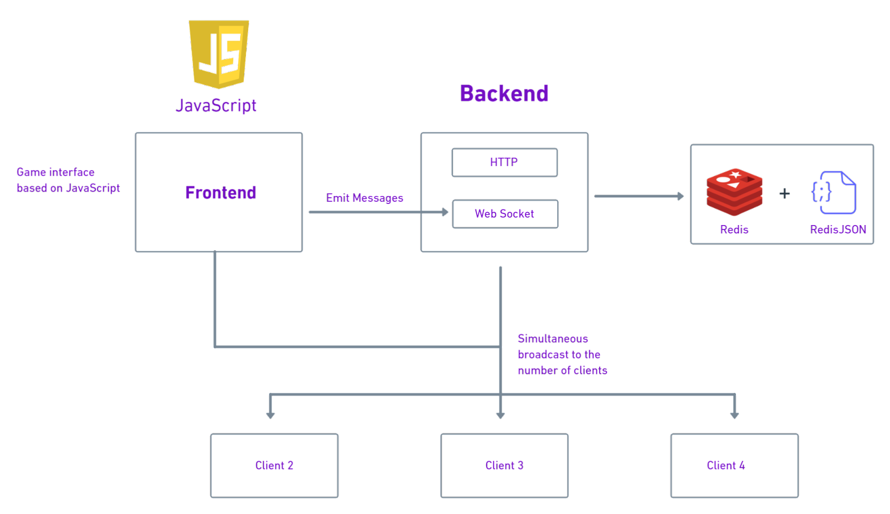

# chess-backend

This project is deployed on [Heroku](https://chess-backend-jh.herokuapp.com/)

## Latest progress

I am currently in the process of figuring out why creating a new game does not work in redis. 
This has been holding up my progress of loading moves to redis and then comiting the finished game to mongo.
So far I have been focusing on `users` and `gameplay`

## Gameplay architecture

### Ideas
- in puzzles make show why a move is bad by showing a sample response
- can i make voice commands to move

### Testing

My testing set up is kind of self developed but for it to work you would need to make the modifications linked bellow 

- https://stackoverflow.com/questions/60372790/node-v13-jest-es6-native-support-for-modules-without-babel-or-esm
- https://stackoverflow.com/questions/19697858/referenceerror-textencoder-is-not-defined

### TODOS
- [ ] post on piazza to ask about a good testing set up + supertest
- [ ] is there a point of adding _id in POST with new ObjectId if mongo does it by default
- [ ] in users why not have GET with id json in the same route instead if /:id?
- [ ] how to prevent people with access to the api from creating / deleting other users
- [ ] is it possible after the user is deleted that a new one will be assigned the old id
- [ ] see how chess games are stored in the database

### Author
Yevhen Horban